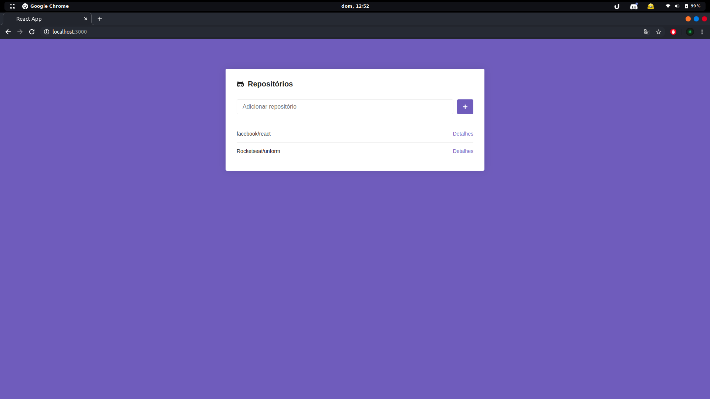
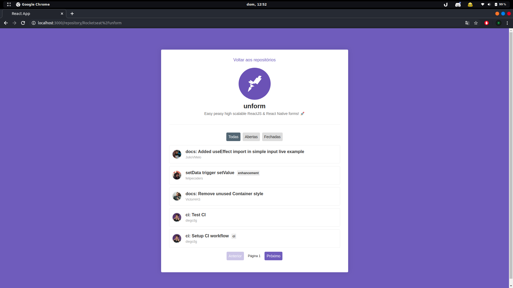

<h1>
  </img>
</h1>




## 🚀 Tecnologias

Esse projeto foi desenvolvido com as seguintes tecnologias:

- [ReactJS](https://reactjs.org/)
- [Axios](https://github.com/axios/axios)
- [Styled Componentes](https://styled-components.com/)
- [GitHub REST API V3](https://developer.github.com/v3/)

## 💾 Instalação

```bash
# Clone o repositório
$ git clone https://github.com/rodrigosakamoto/GoStack-modulo05.git

# e em seguida execute:

$ cd GoStack-modulo05
$ yarn
$ yarn start
```